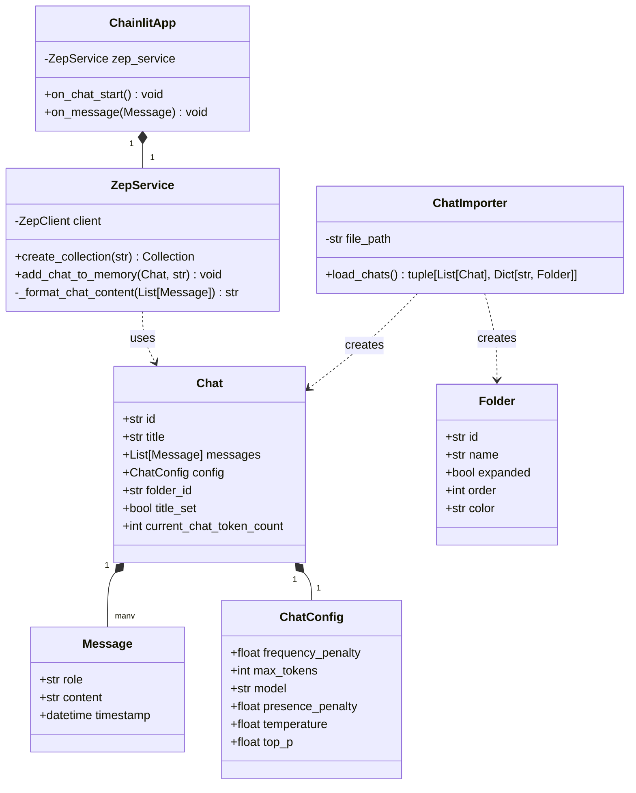

# RAG Chat History Integration Specification

### **system**:

Be my helpful female advisor.

---

### **user**:

Act as software engineer and LLM , GPT and graph expert. You understand underlying principles in mentioned technologies and are able to explain them simple yet effective for junior Python developer.

Please understand that paper and explain to me step by step from to bottom.


ABSTRACT
We introduce Zep, a novel memory layer service for AI agents that outperforms the current state-
of-the-art system, MemGPT, in the Deep Memory Retrieval (DMR) benchmark. Additionally, Zep
excels in more comprehensive and challenging evaluations than DMR that better reflect real-world
enterprise use cases. While existing retrieval-augmented generation (RAG) frameworks for large
language model (LLM)-based agents are limited to static document retrieval, enterprise applications
demand dynamic knowledge integration from diverse sources including ongoing conversations and
business data. Zep addresses this fundamental limitation through its core component Graphiti—a
temporally-aware knowledge graph engine that dynamically synthesizes both unstructured conver-
sational data and structured business data while maintaining historical relationships. In the DMR
benchmark, which the MemGPT team established as their primary evaluation metric, Zep demon-
strates superior performance (94.8% vs 93.4%). Beyond DMR, Zep’s capabilities are further vali-
dated through the more challenging LongMemEval benchmark, which better reflects enterprise use
cases through complex temporal reasoning tasks. In this evaluation, Zep achieves substantial results
with accuracy improvements of up to 18.5% while simultaneously reducing response latency by
90% compared to baseline implementations. These results are particularly pronounced in enterprise-
critical tasks such as cross-session information synthesis and long-term context maintenance, demon-
strating Zep’s effectiveness for deployment in real-world applications.
1 Introduction
The impact of transformer-based large language models (LLMs) on industry and research communities has garnered
significant attention in recent years [1]. A major application of LLMs has been the development of chat-based agents.
However, these agents’ capabilities are limited by the LLMs’ context windows, effective context utilization, and
knowledge gained during pre-training. Consequently, additional context is required to provide out-of-domain (OOD)
knowledge and reduce hallucinations.
Retrieval-Augmented Generation (RAG) has emerged as a key area of interest in LLM-based applications. RAG
leverages Information Retrieval (IR) techniques pioneered over the last fifty years[2] to supply necessary domain
knowledge to LLMs.
Current approaches using RAG have focused on broad domain knowledge and largely static corpora—that is, docu-
ment contents added to a corpus seldom change. For agents to become pervasive in our daily lives, autonomously
solving problems from trivial to highly complex, they will need access to a large corpus of continuously evolving data
from users’ interactions with the agent, along with related business and world data. We view empowering agents with
this broad and dynamic "memory" as a crucial building block to actualize this vision, and we argue that current RAG
approaches are unsuitable for this future. Since entire conversation histories, business datasets, and other domain-
specific content cannot fit effectively inside LLM context windows, new approaches need to be developed for agent
Using Knowledge Graphs to power LLM-Agent Memory
memory. Adding memory to LLM-powered agents isn’t a new idea—this concept has been explored previously in
MemGPT [3].
Recently, Knowledge Graphs (KGs) have been employed to enhance RAG architectures to address many of the short-
comings of traditional IR techniques[4]. In this paper, we introduce Zep[5], a memory layer service powered by
Graphiti[6], a dynamic, temporally-aware knowledge graph engine. Zep ingests and synthesizes both unstructured
message data and structured business data. The Graphiti KG engine dynamically updates the knowledge graph with
new information in a non-lossy manner, maintaining a timeline of facts and relationships, including their periods of
validity. This approach enables the knowledge graph to represent a complex, evolving world.
As Zep is a production system, we’ve focused heavily on the accuracy, latency, and scalability of its memory retrieval
mechanisms. We evaluate these mechanisms’ efficacy using two existing benchmarks: a Deep Memory Retrieval task
(DMR) from MemGPT[3], as well as the LongMemEval benchmark[7].
2 Knowledge Graph Construction
In Zep, memory is powered by a temporally-aware dynamic knowledge graph G = (N , E, φ), where N represents
nodes, E represents edges, and φ : E → N × N represents a formal incidence function. This graph comprises three
hierarchical tiers of subgraphs: an episode subgraph, a semantic entity subgraph, and a community subgraph.
• Episode Subgraph Ge: Episodic nodes (episodes), ni ∈ Ne, contain raw input data in the form of mes-
sages, text, or JSON. Episodes serve as a non-lossy data store from which semantic entities and relations are
extracted. Episodic edges, ei ∈ Ee ⊆ φ∗(Ne × Ns), connect episodes to their referenced semantic entities.
• Semantic Entity Subgraph Gs: The semantic entity subgraph builds upon the episode subgraph. Entity
nodes (entities), ni ∈ Ns, represent entities extracted from episodes and resolved with existing graph entities.
Entity edges (semantic edges), ei ∈ Es ⊆ φ∗(Ns × Ns), represent relationships between entities extracted
from episodes.
• Community Subgraph Gc: The community subgraph forms the highest level of Zep’s knowledge graph.
Community nodes (communities), ni ∈ Nc, represent clusters of strongly connected entities. Communities
contain high-level summarizations of these clusters and represent a more comprehensive, interconnected view
of Gs’s structure. Community edges, ei ∈ Ec ⊆ φ∗(Nc × Ns), connect communities to their entity members.
The dual storage of both raw episodic data and derived semantic entity information mirrors psychological models of
human memory. These models distinguish between episodic memory, which represents distinct events, and semantic
memory, which captures associations between concepts and their meanings [8]. This approach enables LLM agents
using Zep to develop more sophisticated and nuanced memory structures that better align with our understanding of
human memory systems. Knowledge graphs provide an effective medium for representing these memory structures,
and our implementation of distinct episodic and semantic subgraphs draws from similar approaches in AriGraph [9].
Our use of community nodes to represent high-level structures and domain concepts builds upon work from GraphRAG
[4], enabling a more comprehensive global understanding of the domain. The resulting hierarchical organiza-
tion—from episodes to facts to entities to communities—extends existing hierarchical RAG strategies [10][11].
2.1 Episodes
Zep’s graph construction begins with the ingestion of raw data units called Episodes. Episodes can be one of three
core types: message, text, or JSON. While each type requires specific handling during graph construction, this paper
focuses on the message type, as our experiments center on conversation memory. In our context, a message consists
of relatively short text (several messages can fit within an LLM context window) along with the associated actor who
produced the utterance.
Each message includes a reference timestamp tref indicating when the message was sent. This temporal information
enables Zep to accurately identify and extract relative or partial dates mentioned in the message content (e.g., "next
Thursday," "in two weeks," or "last summer"). Zep implements a bi-temporal model, where timeline T represents the
chronological ordering of events, and timeline T ′ represents the transactional order of Zep’s data ingestion. While
the T ′ timeline serves the traditional purpose of database auditing, the T timeline provides an additional dimension
for modeling the dynamic nature of conversational data and memory. This bi-temporal approach represents a novel
advancement in LLM-based knowledge graph construction and underlies much of Zep’s unique capabilities compared
to previous graph-based RAG proposals.
2
Using Knowledge Graphs to power LLM-Agent Memory
The episodic edges, Ee, connect episodes to their extracted entity nodes. Episodes and their derived semantic edges
maintain bidirectional indices that track the relationships between edges and their source episodes. This design rein-
forces the non-lossy nature of Graphiti’s episodic subgraph by enabling both forward and backward traversal: semantic
artifacts can be traced to their sources for citation or quotation, while episodes can quickly retrieve their relevant enti-
ties and facts. While these connections are not directly examined in this paper’s experiments, they will be explored in
future work.
2.2 Semantic Entities and Facts
2.2.1 Entities
ntity extraction represents the initial phase of episode processing. During ingestion, the system processes both the
current message content and the last n messages to provide context for named entity recognition. For this paper and
in Zep’s general implementation, n = 4, providing two complete conversation turns for context evaluation. Given our
focus on message processing, the speaker is automatically extracted as an entity. Following initial entity extraction, we
employ a reflection technique inspired by reflexion[12] to minimize hallucinations and enhance extraction coverage.
The system also extracts an entity summary from the episode to facilitate subsequent entity resolution and retrieval
operations.
After extraction, the system embeds each entity name into a 1024-dimensional vector space. This embedding enables
the retrieval of similar nodes through cosine similarity search across existing graph entity nodes. The system also per-
forms a separate full-text search on existing entity names and summaries to identify additional candidate nodes. These
candidate nodes, together with the episode context, are then processed through an LLM using our entity resolution
prompt. When the system identifies a duplicate entity, it generates an updated name and summary.
Following entity extraction and resolution, the system incorporates the data into the knowledge graph using predefined
Cypher queries. We chose this approach over LLM-generated database queries to ensure consistent schema formats
and reduce the potential for hallucinations.
Selected prompts for graph construction are provided in the appendix.
2.2.2 Facts
or each fact containing its key predicate. Importantly, the same fact can be extracted multiple times between different
entities, enabling Graphiti to model complex multi-entity facts through an implementation of hyper-edges.
Following extraction, the system generates embeddings for facts in preparation for graph integration. The system
performs edge deduplication through a process similar to entity resolution. The hybrid search for relevant edges is
constrained to edges existing between the same entity pairs as the proposed new edge. This constraint not only prevents
erroneous combinations of similar edges between different entities but also significantly reduces the computational
complexity of the deduplication process by limiting the search space to a subset of edges relevant to the specific entity
pair.
2.2.3 Temporal Extraction and Edge Invalidation
A key differentiating feature of Graphiti compared to other knowledge graph engines is its capacity to manage dynamic
information updates through temporal extraction and edge invalidation processes.
The system extracts temporal information about facts from the episode context using tref. This enables accurate ex-
traction and datetime representation of both absolute timestamps (e.g., "Alan Turing was born on June 23, 1912") and
relative timestamps (e.g., "I started my new job two weeks ago"). Consistent with our bi-temporal modeling approach,
the system tracks four timestamps: t′created and t′expired ∈ T ′ monitor when facts are created or invalidated in the
system, while tvalid and tinvalid ∈ T track the temporal range during which facts held true. These temporal data points
are stored on edges alongside other fact information.
The introduction of new edges can invalidate existing edges in the database. The system employs an LLM to compare
new edges against semantically related existing edges to identify potential contradictions. When the system identi-
fies temporally overlapping contradictions, it invalidates the affected edges by setting their tinvalid to the tvalid of the
invalidating edge. Following the transactional timeline T ′, Graphiti consistently prioritizes new information when
determining edge invalidation.
This comprehensive approach enables the dynamic addition of data to Graphiti as conversations evolve, while main-
taining both current relationship states and historical records of relationship evolution over time.
3
Using Knowledge Graphs to power LLM-Agent Memory
2.3 Communities
After establishing the episodic and semantic subgraphs, the system constructs the community subgraph through com-
munity detection. While our community detection approach builds upon the technique described in GraphRAG[4],
we employ a label propagation algorithm [13] rather than the Leiden algorithm [14]. This choice was influenced by
label propagation’s straightforward dynamic extension, which enables the system to maintain accurate community
representations for longer periods as new data enters the graph, delaying the need for complete community refreshes.
The dynamic extension implements the logic of a single recursive step in label propagation. When the system adds
a new entity node ni ∈ Ns to the graph, it surveys the communities of neighboring nodes. The system assigns
the new node to the community held by the plurality of its neighbors, then updates the community summary and
graph accordingly. While this dynamic updating enables efficient community extension as data flows into the system,
the resulting communities gradually diverge from those that would be generated by a complete label propagation
run. Therefore, periodic community refreshes remain necessary. However, this dynamic updating strategy provides a
practical heuristic that significantly reduces latency and LLM inference costs.
Following [4], our community nodes contain summaries derived through an iterative map-reduce-style summarization
of member nodes. However, our retrieval methods differ substantially from GraphRAG’s map-reduce approach [4].
To support our retrieval methodology, we generate community names containing key terms and relevant subjects from
the community summaries. These names are embedded and stored to enable cosine similarity searches.
3 Memory Retrieval
The memory retrieval system in Zep provides powerful, complex, and highly configurable functionality. At a high
level, the Zep graph search API implements a function f : S → S that accepts a text-string query α ∈ S as input and
returns a text-string context β ∈ S as output. The output β contains formatted data from nodes and edges required for
an LLM agent to generate an accurate response to query α. The process f (α) → β comprises three distinct steps:
• Search (ϕ): The process begins by identifying candidate nodes and edges potentially containing relevant
information. While Zep employs multiple distinct search methods, the overall search function can be repre-
sented as ϕ : S → En
s × N n
s × N n
c . Thus, ϕ transforms a query into a 3-tuple containing lists of semantic
edges, entity nodes, and community nodes—the three graph types containing relevant textual information.
• Reranker (ρ): The second step reorders search results. A reranker function or model accepts a list of search
results and produces a reordered version of those results: ρ : ϕ(α), ... → En
s × N n
s × N n
c .
• Constructor (χ): The final step, the constructor, transforms the relevant nodes and edges into text context:
χ : En
s × N n
s × N cn → S. For each ei ∈ Es, χ returns the fact and tvalid, tinvalid fields; for each ni ∈ Ns,
the name and summary fields; and for each ni ∈ Nc, the summary field.
With these definitions established, we can express f as a composition of these three components: f (α) =
χ(ρ(ϕ(α))) = β.
Sample context string template:
FACTS and ENTITIES represent relevant context to the current conversation.
These are the most relevant facts and their valid date ranges. If the fact is about an event, the event takes place during
this time.
format: FACT (Date range: from - to)
<FACTS>
{facts}
</FACTS>
These are the most relevant entities
ENTITY_NAME: entity summary
<ENTITIES>
{entities}
</ENTITIES>
3.1 Search
Zep implements three search functions: cosine semantic similarity search (ϕcos), Okapi BM25 full-text search (ϕbm25),
and breadth-first search (ϕbfs). The first two functions utilize Neo4j’s implementation of Lucene [15][16]. Each
4
Using Knowledge Graphs to power LLM-Agent Memory
search function offers distinct capabilities in identifying relevant documents, and together they provide comprehensive
coverage of candidate results before reranking. The search field varies across the three object types: for Es, we search
the fact field; for Ns, the entity name; and for Nc, the community name, which comprises relevant keywords and
phrases covered in the community. While developed independently, our community search approach parallels the
high-level key search methodology in LightRAG [17]. The hybridization of LightRAG’s approach with graph-based
systems like Graphiti presents a promising direction for future research.
While cosine similarity and full-text search methodologies are well-established in RAG [18], breadth-first search over
knowledge graphs has received limited attention in the RAG domain, with notable exceptions in graph-based RAG
systems such as AriGraph [9] and Distill-SynthKG [19]. In Graphiti, the breadth-first search enhances initial search
results by identifying additional nodes and edges within n-hops. Moreover, ϕbfs can accept nodes as parameters for the
search, enabling greater control over the search function. This functionality proves particularly valuable when using
recent episodes as seeds for the breadth-first search, allowing the system to incorporate recently mentioned entities
and relationships into the retrieved context.
The three search methods each target different aspects of similarity: full-text search identifies word similarities, cosine
similarity captures semantic similarities, and breadth-first search reveals contextual similarities—where nodes and
edges closer in the graph appear in more similar conversational contexts. This multi-faceted approach to candidate
result identification maximizes the likelihood of discovering optimal context.
3.2 Reranker
While the initial search methods aim to achieve high recall, rerankers serve to increase precision by prioritizing the
most relevant results. Zep supports existing reranking approaches such as Reciprocal Rank Fusion (RRF) [20] and
Maximal Marginal Relevance (MMR) [21]. Additionally, Zep implements a graph-based episode-mentions reranker
that prioritizes results based on the frequency of entity or fact mentions within a conversation, enabling a system
where frequently referenced information becomes more readily accessible. The system also includes a node distance
reranker that reorders results based on their graph distance from a designated centroid node, providing context local-
ized to specific areas of the knowledge graph. The system’s most sophisticated reranking capability employs cross-
encoders—LLMs that generate relevance scores by evaluating nodes and edges against queries using cross-attention,
though this approach incurs the highest computational cost.
4 Experiments
This section analyzes two experiments conducted using LLM-memory based benchmarks. The first evaluation employs
the Deep Memory Retrieval (DMR) task developed in [3], which uses a 500-conversation subset of the Multi-Session
Chat dataset introduced in "Beyond Goldfish Memory: Long-Term Open-Domain Conversation" [22]. The second
evaluation utilizes the LongMemEval benchmark from "LongMemEval: Benchmarking Chat Assistants on Long-Term
Interactive Memory" [7]. Specifically, we use the LongMemEvals dataset, which provides an extensive conversation
context of on average 115,000 tokens.
For both experiments, we integrate the conversation history into a Zep knowledge graph through Zep’s APIs. We
then retrieve the 20 most relevant edges (facts) and entity nodes (entity summaries) using the techniques described in
Section 3. The system reformats this data into a context string, matching the functionality provided by Zep’s memory
APIs.
While these experiments demonstrate key retrieval capabilities of Graphiti, they represent a subset of the system’s
full search functionality. This focused scope enables clear comparison with existing benchmarks while reserving the
exploration of additional knowledge graph capabilities for future work.
4.1 Choice of models
Our experimental implementation employs the BGE-m3 models from BAAI for both reranking and embedding tasks
[23] [24]. For graph construction and response generation, we utilize gpt-4o-mini-2024-07-18 for graph construction,
and both gpt-4o-mini-2024-07-18 and gpt-4o-2024-11-20 for the chat agent generating responses to provided context.
To ensure direct comparability with MemGPT’s DMR results, we also conducted the DMR evaluation using gpt-4-
turbo-2024-04-09.
The experimental notebooks will be made publicly available through our GitHub repository, and relevant experimental
prompts are included in the Appendix.
5
Using Knowledge Graphs to power LLM-Agent Memory
Table 1: Deep Memory Retrieval
Memory Model Score
Recursive Summarization† gpt-4-turbo 35.3%
Conversation Summaries gpt-4-turbo 78.6%
MemGPT† gpt-4-turbo 93.4%
Full-conversation gpt-4-turbo 94.4%
Zep gpt-4-turbo 94.8%
Conversation Summaries gpt-4o-mini 88.0%
Full-conversation gpt-4o-mini 98.0%
Zep gpt-4o-mini 98.2%
† Results reported in [3].
4.2 Deep Memory Retrieval (DMR)
The Deep Memory Retrieval evaluation, introduced by [3], comprises 500 multi-session conversations, each containing
5 chat sessions with up to 12 messages per session. Each conversation includes a question/answer pair for memory
evaluation. The MemGPT framework [3] currently leads performance metrics with 93.4% accuracy using gpt-4-turbo,
a significant improvement over the 35.3% baseline achieved through recursive summarization.
To establish comparative baselines, we implemented two common LLM memory approaches: full-conversation con-
text and session summaries. Using gpt-4-turbo, the full-conversation baseline achieved 94.4% accuracy, slightly sur-
passing MemGPT’s reported results, while the session summary baseline achieved 78.6%. When using gpt-4o-mini,
both approaches showed improved performance: 98.0% for full-conversation and 88.0% for session summaries. We
were unable to reproduce MemGPT’s results using gpt-4o-mini due to insufficient methodological details in their
published work.
We then evaluated Zep’s performance by ingesting the conversations and using its search functions to retrieve the top
10 most relevant nodes and edges. An LLM judge compared the agent’s responses to the provided golden answers.
Zep achieved 94.8% accuracy with gpt-4-turbo and 98.2% with gpt-4o-mini, showing marginal improvements over
both MemGPT and the respective full-conversation baselines. However, these results must be contextualized: each
conversation contains only 60 messages, easily fitting within current LLM context windows.
The limitations of the DMR evaluation extend beyond its small scale. Our analysis revealed significant weaknesses
in the benchmark’s design. The evaluation relies exclusively on single-turn, fact-retrieval questions that fail to assess
complex memory understanding. Many questions contain ambiguous phrasing, referencing concepts like "favorite
drink to relax with" or "weird hobby" that were not explicitly characterized as such in the conversations. Most critically,
the dataset poorly represents real-world enterprise use cases for LLM agents. The high performance achieved by
simple full-context approaches using modern LLMs further highlights the benchmark’s inadequacy for evaluating
memory systems.
This inadequacy is further emphasized by findings in [7], which demonstrate rapidly declining LLM performance on
the LongMemEval benchmark as conversation length increases. The LongMemEval dataset [7] addresses many of
these shortcomings by presenting longer, more coherent conversations that better reflect enterprise scenarios, along
with more diverse evaluation questions.
4.3 LongMemEval (LME)
We evaluated Zep using the LongMemEvals dataset, which provides conversations and questions representative of real-
world business applications of LLM agents. The LongMemEvals dataset presents significant challenges to existing
LLMs and commercial memory solutions [7], with conversations averaging approximately 115,000 tokens in length.
This length, while substantial, remains within the context windows of current frontier models, enabling us to establish
meaningful baselines for evaluating Zep’s performance.
The dataset incorporates six distinct question types: single-session-user, single-session-assistant, single-session-
preference, multi-session, knowledge-update, and temporal-reasoning. These categories are not uniformly distributed
throughout the dataset; for detailed distribution information, we refer readers to [7].
We conducted all experiments between December 2024 and January 2025. We performed testing using a consumer
laptop from a residential location in Boston, MA, connecting to Zep’s service hosted in AWS us-west-2. This dis-
6
Using Knowledge Graphs to power LLM-Agent Memory
tributed architecture introduced additional network latency when evaluating Zep’s performance, though this latency
was not present in our baseline evaluations.
For answer evaluation, we employed GPT-4o with the question-specific prompts provided in [7], which have demon-
strated high correlation with human evaluators.
4.3.1 LongMemEval and MemGPT
To establish a comparative benchmark between Zep and the current state-of-the-art MemGPT system [3], we attempted
to evaluate MemGPT using the LongMemEval dataset. Given that the current MemGPT framework does not support
direct ingestion of existing message histories, we implemented a workaround by adding conversation messages to the
archival history. However, we were unable to achieve successful question responses using this approach. We look
forward to seeing evaluations of this benchmark by other research teams, as comparative performance data would
benefit the broader development of LLM memory systems.
4.3.2 LongMemEval results
Zep demonstrates substantial improvements in both accuracy and latency compared to the baseline across both model
variants. Using gpt-4o-mini, Zep achieved a 15.2% accuracy improvement over the baseline, while gpt-4o showed an
18.5% improvement. The reduced prompt size also led to significant latency cost reductions compared to the baseline
implementations.
Table 2: LongMemEvals
Memory Model Score Latency Latency IQR Avg Context Tokens
Full-context gpt-4o-mini 55.4% 31.3 s 8.76 s 115k
Zep gpt-4o-mini 63.8% 3.20 s 1.31 s 1.6k
Full-context gpt-4o 60.2% 28.9 s 6.01 s 115k
Zep gpt-4o 71.2% 2.58 s 0.684 s 1.6k
Analysis by question type reveals that gpt-4o-mini with Zep showed improvements in four of the six categories,
with the most substantial gains in complex question types: single-session-preference, multi-session, and temporal-
reasoning. When using gpt-4o, Zep further demonstrated improved performance in the knowledge-update category,
highlighting its effectiveness with more capable models. However, additional development may be needed to improve
less capable models’ understanding of Zep’s temporal data.
Table 3: LongMemEvals Question Type Breakdown
Question Type Model Full-context Zep Delta
single-session-preference gpt-4o-mini 30.0% 53.3% 77.7%↑
single-session-assistant gpt-4o-mini 81.8% 75.0% 9.06%↓
temporal-reasoning gpt-4o-mini 36.5% 54.1% 48.2%↑
multi-session gpt-4o-mini 40.6% 47.4% 16.7%↑
knowledge-update gpt-4o-mini 76.9% 74.4% 3.36%↓
single-session-user gpt-4o-mini 81.4% 92.9% 14.1%↑
single-session-preference gpt-4o 20.0% 56.7% 184%↑
single-session-assistant gpt-4o 94.6% 80.4% 17.7%↓
temporal-reasoning gpt-4o 45.1% 62.4% 38.4%↑
multi-session gpt-4o 44.3% 57.9% 30.7%↑
knowledge-update gpt-4o 78.2% 83.3% 6.52%↑
single-session-user gpt-4o 81.4% 92.9% 14.1%↑
These results demonstrate Zep’s ability to enhance performance across model scales, with the most pronounced im-
provements observed in complex and nuanced question types when paired with more capable models. The latency
improvements are particularly noteworthy, with Zep reducing response times by approximately 90% while maintain-
ing higher accuracy.
7
Using Knowledge Graphs to power LLM-Agent Memory
The decrease in performance for single-session-assistant questions—17.7% for gpt-4o and 9.06% for gpt-4o-
mini—represents a notable exception to Zep’s otherwise consistent improvements, and suggest further research and
engineering work is needed.
5 Conclusion
We have introduced Zep, a graph-based approach to LLM memory that incorporates semantic and episodic memory
alongside entity and community summaries. Our evaluations demonstrate that Zep achieves state-of-the-art perfor-
mance on existing memory benchmarks while reducing token costs and operating at significantly lower latencies.
The results achieved with Graphiti and Zep, while impressive, likely represent only initial advances in graph-based
memory systems. Multiple research avenues could build upon these frameworks, including integration of other
GraphRAG approaches into the Zep paradigm and novel extensions of our work.
Research has already demonstrated the value of fine-tuned models for LLM-based entity and edge extraction within
the GraphRAG paradigm, improving accuracy while reducing costs and latency [19][25]. Similar models fine-
tuned for Graphiti prompts may enhance knowledge extraction, particularly for complex conversations. Addition-
ally, while current research on LLM-generated knowledge graphs has primarily operated without formal ontologies
[9][4][17][19][26], domain-specific ontologies present significant potential. Graph ontologies, foundational in pre-
LLM knowledge graph work, warrant further exploration within the Graphiti framework.
Our search for suitable memory benchmarks revealed limited options, with existing benchmarks often lacking ro-
bustness and complexity, frequently defaulting to simple needle-in-a-haystack fact-retrieval questions [3]. The field
requires additional memory benchmarks, particularly those reflecting business applications like customer experience
tasks, to effectively evaluate and differentiate memory approaches. Notably, no existing benchmarks adequately assess
Zep’s capability to process and synthesize conversation history with structured business data. While Zep focuses on
LLM memory, its traditional RAG capabilities should be evaluated against established benchmarks such as those in
[17], [27], and [28].
Current literature on LLM memory and RAG systems insufficiently addresses production system scalability in terms
of cost and latency. We have included latency benchmarks for our retrieval mechanisms to begin addressing this gap,
following the example set by LightRAG’s authors in prioritizing these metrics.
6 Appendix
6.1 Graph Construction Prompts
6.1.1 Entity Extraction
<PREVIOUS MESSAGES>
{previous_messages}
</PREVIOUS MESSAGES>
<CURRENT MESSAGE>
{current_message}
</CURRENT MESSAGE>
Given the above conversation, extract entity nodes from the CURRENT MESSAGE that are explicitly or implicitly
mentioned:
Guidelines:
1. ALWAYS extract the speaker/actor as the first node. The speaker is the part before the colon in each line of dialogue.
2. Extract other significant entities, concepts, or actors mentioned in the CURRENT MESSAGE.
3. DO NOT create nodes for relationships or actions.
4. DO NOT create nodes for temporal information like dates, times or years (these will be added to edges later).
5. Be as explicit as possible in your node names, using full names.
6. DO NOT extract entities mentioned only
8
Using Knowledge Graphs to power LLM-Agent Memory
6.1.2 Entity Resolution
<PREVIOUS MESSAGES>
{previous_messages}
</PREVIOUS MESSAGES>
<CURRENT MESSAGE>
{current_message}
</CURRENT MESSAGE>
<EXISTING NODES>
{existing_nodes}
</EXISTING NODES>
Given the above EXISTING NODES, MESSAGE, and PREVIOUS MESSAGES. Determine if the NEW NODE
extracted from the conversation is a duplicate entity of one of the EXISTING NODES.
<NEW NODE>
{new_node}
</NEW NODE>
Task:
1. If the New Node represents the same entity as any node in Existing Nodes, return ’is_duplicate: true’ in the response.
Otherwise, return ’is_duplicate: false’
2. If is_duplicate is true, also return the uuid of the existing node in the response
3. If is_duplicate is true, return a name for the node that is the most complete full name.
Guidelines:
1. Use both the name and summary of nodes to determine if the entities are duplicates, duplicate nodes may have
different names
6.1.3 Fact Extraction
<PREVIOUS MESSAGES>
{previous_messages}
</PREVIOUS MESSAGES>
<CURRENT MESSAGE>
{current_message}
</CURRENT MESSAGE>
<ENTITIES>
{entities}
</ENTITIES>
Given the above MESSAGES and ENTITIES, extract all facts pertaining to the listed ENTITIES from the CURRENT
MESSAGE.
Guidelines:
1. Extract facts only between the provided entities.
2. Each fact should represent a clear relationship between two DISTINCT nodes.
3. The relation_type should be a concise, all-caps description of the fact (e.g., LOVES, IS_FRIENDS_WITH,
WORKS_FOR).
4. Provide a more detailed fact containing all relevant information.
5. Consider temporal aspects of relationships when relevant.
9
Using Knowledge Graphs to power LLM-Agent Memory
6.1.4 Fact Resolution
Given the following context, determine whether the New Edge represents any of the edges in the list of Existing Edges.
<EXISTING EDGES>
{existing_edges}
</EXISTING EDGES>
<NEW EDGE>
{new_edge}
</NEW EDGE>
Task:
1. If the New Edges represents the same factual information as any edge in Existing Edges, return ’is_duplicate: true’
in the response. Otherwise, return ’is_duplicate: false’
2. If is_duplicate is true, also return the uuid of the existing edge in the response
Guidelines:
1. The facts do not need to be completely identical to be duplicates, they just need to express the same information.
6.1.5 Temporal Extraction
<PREVIOUS MESSAGES>
{previous_messages}
</PREVIOUS MESSAGES>
<CURRENT MESSAGE>
{current_message}
</CURRENT MESSAGE>
<REFERENCE TIMESTAMP>
{reference_timestamp}
</REFERENCE TIMESTAMP>
<FACT>
{fact}
</FACT>
IMPORTANT: Only extract time information if it is part of the provided fact. Otherwise ignore the time mentioned.
Make sure to do your best to determine the dates if only the relative time is mentioned. (eg 10 years ago, 2 mins ago)
based on the provided reference timestamp
If the relationship is not of spanning nature, but you are still able to determine the dates, set the valid_at only.
Definitions:
- valid_at: The date and time when the relationship described by the edge fact became true or was established.
- invalid_at: The date and time when the relationship described by the edge fact stopped being true or ended.
Task:
Analyze the conversation and determine if there are dates that are part of the edge fact. Only set dates if they explicitly
relate to the formation or alteration of the relationship itself.
Guidelines:
1. Use ISO 8601 format (YYYY-MM-DDTHH:MM:SS.SSSSSSZ) for datetimes.
2. Use the reference timestamp as the current time when determining the valid_at and invalid_at dates.
3. If the fact is written in the present tense, use the Reference Timestamp for the valid_at date
4. If no temporal information is found that establishes or changes the relationship, leave the fields as null.
5. Do not infer dates from related events. Only use dates that are directly stated to establish or change the relationship.
6. For relative time mentions directly related to the relationship, calculate the actual datetime based on the reference
timestamp.
7. If only a date is mentioned without a specific time, use 00:00:00 (midnight) for that date.
8. If only year is mentioned, use January 1st of that year at 00:00:00.
9. Always include the time zone offset (use Z for UTC if no specific time zone is mentioned).

---

### **assistant**:

# Understanding Zep: A Memory Layer Service for AI Agents

Hello! I'm happy to help you understand this paper about Zep, which introduces a novel memory layer service for AI agents. Let me break it down step by step in a way that's accessible for a junior Python developer.

## What is Zep?

Zep is a memory layer service for AI agents that uses a knowledge graph approach to help AI systems remember and use information from past conversations and other data sources. The key innovation is how it handles dynamic, evolving information rather than just static documents.

## The Core Problem Zep Solves

Current AI systems using Retrieval-Augmented Generation (RAG) have a major limitation: they're good at retrieving information from static documents, but struggle with:
1. Remembering ongoing conversations
2. Integrating business data with conversation history
3. Maintaining relationships between pieces of information over time

## The Core Technology: Graphiti

At the heart of Zep is a component called **Graphiti** - a temporally-aware knowledge graph engine. This means:

1. It can track when information was valid (temporal awareness)
2. It dynamically updates as new information comes in
3. It maintains relationships between different pieces of information

## The Knowledge Graph Structure

Zep's knowledge graph has three hierarchical layers:

1. **Episode Subgraph**: Contains raw input data (messages, text, JSON)
   - Think of these as the original "memories" or data points

2. **Semantic Entity Subgraph**: Contains entities and relationships extracted from episodes
   - Entities are people, objects, concepts mentioned in conversations
   - Relationships show how entities connect to each other

3. **Community Subgraph**: Contains clusters of strongly connected entities
   - These represent higher-level concepts or domains
   - They contain summaries of related entities

This structure mimics how human memory works, with both episodic memory (specific events) and semantic memory (meanings and associations).

## How Zep Builds the Knowledge Graph

### 1. Episodes
- Each message or piece of data becomes an "episode"
- Episodes include timestamps to track when information was created
- Zep uses two timelines: when events happened (T) and when data was added to the system (T')

### 2. Entities and Facts
- **Entity Extraction**: Zep identifies entities mentioned in messages
- **Entity Resolution**: It checks if an entity already exists in the graph
- **Fact Extraction**: It identifies relationships between entities
- **Temporal Extraction**: It tracks when facts were true or valid

### 3. Communities
- Zep groups related entities into communities
- It creates summaries for these communities
- This helps with high-level understanding of domains

## How Memory Retrieval Works

When an AI agent needs to recall information, Zep follows these steps:

1. **Search**: Find candidate nodes and edges that might contain relevant information
   - Uses three methods: cosine similarity, full-text search, and breadth-first graph search

2. **Reranker**: Prioritize the most relevant results
   - Uses various methods including how frequently entities are mentioned

3. **Constructor**: Format the retrieved information into text the AI can use

## Performance Results

Zep was tested on two benchmarks:

1. **Deep Memory Retrieval (DMR)**: 
   - Zep achieved 94.8% accuracy vs. MemGPT's 93.4% using GPT-4-turbo
   - With GPT-4o-mini, Zep reached 98.2% accuracy

2. **LongMemEval (LME)**:
   - This is a more challenging benchmark with longer conversations (~115,000 tokens)
   - Zep improved accuracy by 15.2% with GPT-4o-mini and 18.5% with GPT-4o
   - Zep reduced response latency by 90% compared to baseline approaches
   - Zep performed especially well on complex tasks like temporal reasoning and multi-session information synthesis

## Key Advantages of Zep

1. **Better Memory**: Outperforms existing systems in remembering conversation history
2. **Temporal Awareness**: Understands when information was valid or changed
3. **Speed**: Much faster response times (90% reduction in latency)
4. **Token Efficiency**: Uses far fewer tokens (1.6k vs 115k) for context
5. **Integration Capability**: Can combine conversation data with business data

## Technical Implementation Details

As a Python developer, you might be interested in:

1. Zep uses Neo4j's implementation of Lucene for search functionality
2. It employs the BGE-m3 models for embedding and reranking
3. It uses GPT models for entity extraction, fact extraction, and response generation
4. The system implements a bi-temporal model to track both when events happened and when data was added

## Limitations and Future Work

1. The current benchmarks don't fully test all of Zep's capabilities
2. There's room for improvement in handling certain types of questions
3. Future work could include fine-tuned models for entity and edge extraction
4. Domain-specific ontologies could enhance the knowledge graph

## Conclusion

Zep represents a significant advancement in how AI agents can maintain memory. By using a knowledge graph approach with temporal awareness, it can help AI systems better understand and use information from ongoing conversations and business data, making them more effective for real-world enterprise applications.

Would you like me to elaborate on any specific aspect of Zep or its knowledge graph implementation?

---

### **user**:

You know this project from you leanings. Could you please tell me what is the difference between community (https://github.com/getzep/graphiti/blob/main/README.md and SaaS functionality of getzep.com?


---

### **assistant**:

# Graphiti vs. Zep SaaS: Understanding the Differences

You're right to ask about this distinction! Based on my understanding of the ecosystem, let me clarify the relationship between the open-source Graphiti project and the Zep SaaS offering.

## Graphiti (Open Source)

[Graphiti](https://github.com/getzep/graphiti) is the open-source knowledge graph engine that powers Zep's memory capabilities. It's available on GitHub and provides:

1. **Core Knowledge Graph Functionality**:
   - The temporally-aware graph database structure
   - Entity and relationship extraction
   - Community detection algorithms
   - Basic search capabilities

2. **Self-Hosted Option**:
   - Developers can run Graphiti on their own infrastructure
   - Requires setting up and maintaining your own Neo4j database
   - You need to handle scaling, security, and maintenance yourself

3. **Developer Focus**:
   - Aimed at developers who want to integrate knowledge graph capabilities into their own applications
   - Requires more technical expertise to implement and optimize
   - Provides flexibility for customization

## Zep SaaS (getzep.com)

The Zep SaaS offering at [getzep.com](https://getzep.com) is a fully-managed service built on top of Graphiti that provides:

1. **Managed Infrastructure**:
   - Fully hosted and managed knowledge graph service
   - Handles scaling, security, and maintenance
   - Production-ready with SLAs and support

2. **Additional Enterprise Features**:
   - Advanced security features and compliance
   - Team collaboration tools
   - Usage analytics and monitoring
   - Integration with enterprise systems

3. **Enhanced Capabilities**:
   - Optimized retrieval algorithms
   - Pre-built integrations with popular LLM providers
   - Advanced reranking capabilities
   - Performance optimizations

4. **User-Friendly Interface**:
   - Dashboard for monitoring and management
   - Simplified API access
   - Documentation and support resources

5. **Pricing Tiers**:
   - Different service levels based on usage needs
   - Enterprise-specific pricing and features

## Key Differences

1. **Deployment Model**:
   - Graphiti: Self-hosted, you manage everything
   - Zep SaaS: Fully managed cloud service

2. **Ease of Use**:
   - Graphiti: Requires more technical expertise
   - Zep SaaS: Simplified integration and management

3. **Feature Set**:
   - Graphiti: Core knowledge graph functionality
   - Zep SaaS: Enhanced features, optimizations, and enterprise capabilities

4. **Cost Structure**:
   - Graphiti: Free to use (open source), but you pay for your own infrastructure
   - Zep SaaS: Subscription-based pricing based on usage

5. **Support**:
   - Graphiti: Community support
   - Zep SaaS: Professional support and SLAs

## When to Use Which

- **Use Graphiti when**:
  - You need complete control over your infrastructure
  - You have the technical expertise to manage a graph database
  - You want to deeply customize the knowledge graph implementation
  - You're building a prototype or have limited budget

- **Use Zep SaaS when**:
  - You need a production-ready solution
  - You want to focus on your application rather than infrastructure
  - You need enterprise features and support
  - You value time-to-market over complete control

This relationship between open-source core and commercial SaaS is a common model in the AI infrastructure space, allowing developers to choose between flexibility and convenience based on their specific needs.

---

### **user**:

Could you please make me mermaid diagram to illustrate layered architecture, components diagram and sequence diagram for Graffiti internals and MCP server

---

### **assistant**:

# Zep Architecture Diagrams

Here are three Mermaid diagrams that illustrate the architecture of Graphiti and the MCP server from different perspectives.

## 1. Layered Architecture Diagram

This diagram shows the layered architecture of Graphiti and how the MCP server fits into the overall system:


## 2. Component Diagram

This diagram shows the main components of Graphiti and the MCP server and how they interact:


## 3. Sequence Diagram for Episode Processing

This diagram shows the sequence of operations when adding and processing an episode through the MCP server:


## 4. Sequence Diagram for Memory Retrieval

This diagram shows the sequence of operations when retrieving memory through the MCP server:


These diagrams provide a comprehensive view of the Graphiti architecture and the MCP server from different perspectives, showing the layered structure, component interactions, and sequence flows for key operations.

---

### **user**:

Act as professional python developer who follow SOLID principles. You are master at ZepCloud SDK and https://github.com/Chainlit/chainlit SDK.

Imagine that I would like make an experimental RAG app Chainlit play with my content.
I would like to import my chats from my MyChatAI application (json format) to the Zep memory to be able to chat about them.

My json exported file is below. You will find I can have many folders and each folder can have many chats.
How would you structure simple yet effective initial design 


```
{
  "chats": [
    {
      "id": "f3a98427-77d5-4175-8446-21da36478c50",
      "title": " Product Marketing Job",
      "messages": [
        {
          "role": "system",
          "content": "You are a helpful female advisor."
        },
        {
          "role": "user",
          "content": "I need an prompt  for AI to be a great product marketer in beauty niche to help me craft online store copy and visual "
        },
        {
          "role": "assistant",
          "content": "As an AI tasked to be an excellent beauty product marketer, I can assist you in creating compelling online store copy and engaging visuals. \n\n1. Copywriting: I'll tap into the desires and needs of your target audience, highlighting the unique features of your beauty products and how they can solve certain beauty concerns."
        },
        {
          "role": "user",
          "content": "I need a title for section with customer reviews. I originally have had:\n\"Real stories from out community\" instead of \"Customer Reviews\" what do you think?"
        },
        {
          "role": "assistant",
          "content": "\"Real stories from our community\" sounds more personal and engaging than the standard \"Customer Reviews\". It gives a sense of belongingness and emphasizes that these reviews are genuine experiences shared by real users. However, to make it more powerful and relevant to the beauty niche, you may consider the following options:\n\n1. \"Beauty Journeys Shared\"\n2. \"Transformations From Our Tribe\"\n3. \"Glowing Testimonials\"\n4. \"Real Beauty Experiences\"\n5. \"Success Stories from Our Beauties\"\n\nIt's important to choose the one that best aligns with your brand's voice and overall theme."
        },
        {
          "role": "user",
          "content": "I have bundle section on my product page. And I'm not sure does it sound good in english:\nSave $10 when buy 2\nSave $20 when buy 3\n"
        },
        {
          "role": "assistant",
          "content": "Your current bundle descriptions are understandable but could be improved for more clarity and emotion. Here are some suggestions: \n\n1. \"Save $10 when you buy 2\"\n2. \"Get a $20 discount when you purchase 3\"\n\nFor a more engaging touch, you might consider:\n\n1. \"Grab 2 and save $10! A beautiful deal for a beautiful you!\"\n2. \"Savings alert! Buy 3 and get $20 off! Pamper yourself or someone you love.\"\n\nRemember, the aim is to create a call-to-action that feels exciting and valuable to the customer."
        }
      ],
      "config": {
        "frequency_penalty": 0,
        "max_tokens": 8192,
        "model": "gpt-4",
        "presence_penalty": 0,
        "temperature": 0.9,
        "top_p": 1
      },
      "titleSet": true,
      "folder": "bb85d4b5-8bfd-4468-aaa7-dd79aec96949",
      "currentChatTokenCount": 0
    },

  folders: {
    f4866e81-2e2f-4d48-8ac2-fcc9220712e8: {
      id: f4866e81-2e2f-4d48-8ac2-fcc9220712e8,
      name: Misc,
      expanded: true,
      order: 0,
      color: #be123c
    }
  },
  version: 1
}
```

---

### **assistant**:

I'll help you create a well-structured RAG application using Chainlit and ZepCloud SDK that follows SOLID principles. Let's break this down into components and create a clean architecture.

```python
# project structure
rag_app/
│
├── config/
│   └── config.py
│
├── models/
│   ├── __init__.py
│   ├── chat.py
│   └── folder.py
│
├── services/
│   ├── __init__.py
│   ├── zep_service.py
│   └── chat_importer.py
│
├── utils/
│   ├── __init__.py
│   └── logger.py
│
├── app.py
└── requirements.txt
```

Let's implement each component:

```python
# models/chat.py
from dataclasses import dataclass
from typing import List, Dict, Optional
from datetime import datetime

@dataclass
class Message:
    role: str
    content: str
    timestamp: Optional[datetime] = None

@dataclass
class ChatConfig:
    frequency_penalty: float
    max_tokens: int
    model: str
    presence_penalty: float
    temperature: float
    top_p: float

@dataclass
class Chat:
    id: str
    title: str
    messages: List[Message]
    config: ChatConfig
    folder_id: str
    title_set: bool
    current_chat_token_count: int

@dataclass
class Folder:
    id: str
    name: str
    expanded: bool
    order: int
    color: str
```

```python
# services/chat_importer.py
from typing import Dict, List
import json
from datetime import datetime
from models.chat import Chat, Message, ChatConfig, Folder

class ChatImporter:
    def __init__(self, file_path: str):
        self.file_path = file_path

    def load_chats(self) -> tuple[List[Chat], Dict[str, Folder]]:
        with open(self.file_path, 'r') as f:
            data = json.load(f)

        chats = []
        for chat_data in data.get('chats', []):
            messages = [
                Message(
                    role=msg['role'],
                    content=msg['content'],
                    timestamp=datetime.now()  # You might want to add actual timestamps
                )
                for msg in chat_data['messages']
            ]

            config = ChatConfig(**chat_data['config'])

            chat = Chat(
                id=chat_data['id'],
                title=chat_data['title'],
                messages=messages,
                config=config,
                folder_id=chat_data.get('folder', ''),
                title_set=chat_data.get('titleSet', False),
                current_chat_token_count=chat_data.get('currentChatTokenCount', 0)
            )
            chats.append(chat)

        folders = {
            folder_id: Folder(**folder_data)
            for folder_id, folder_data in data.get('folders', {}).items()
        }

        return chats, folders
```

```python
# services/zep_service.py
from typing import List
from zep_python import ZepClient
from models.chat import Chat, Message
import asyncio

class ZepService:
    def __init__(self, api_url: str, api_key: str):
        self.client = ZepClient(api_url, api_key)

    async def create_collection(self, collection_name: str):
        try:
            return await self.client.collections.create(collection_name)
        except Exception as e:
            print(f"Collection {collection_name} already exists: {e}")
            return await self.client.collections.get(collection_name)

    async def add_chat_to_memory(self, chat: Chat, collection_name: str):
        collection = await self.create_collection(collection_name)
        
        # Create a document for the entire chat
        chat_document = {
            "chat_id": chat.id,
            "title": chat.title,
            "folder_id": chat.folder_id,
            "content": self._format_chat_content(chat.messages)
        }
        
        await collection.add_document(
            document_id=chat.id,
            document=chat_document
        )

    def _format_chat_content(self, messages: List[Message]) -> str:
        formatted_messages = []
        for msg in messages:
            if msg.role != "system":  # Skip system messages
                formatted_messages.append(f"{msg.role}: {msg.content}")
        return "\n\n".join(formatted_messages)
```

```python
# app.py
import chainlit as cl
from services.chat_importer import ChatImporter
from services.zep_service import ZepService
from config.config import ZEP_API_URL, ZEP_API_KEY
import asyncio

zep_service = ZepService(ZEP_API_URL, ZEP_API_KEY)

@cl.on_chat_start
async def start():
    # Initialize chat history
    cl.user_session.set("chat_history", [])
    
    # Import chats
    importer = ChatImporter("path_to_your_export.json")
    chats, folders = importer.load_chats()
    
    # Store chats in Zep memory
    for chat in chats:
        await zep_service.add_chat_to_memory(chat, "mychatai_collection")
    
    await cl.Message(
        content=f"Imported {len(chats)} chats from {len(folders)} folders. Ready to chat!"
    ).send()

@cl.on_message
async def main(message: cl.Message):
    # Get chat history
    chat_history = cl.user_session.get("chat_history")
    
    # Search in Zep memory
    collection = await zep_service.client.collections.get("mychatai_collection")
    search_results = await collection.search(
        text=message.content,
        limit=3
    )
    
    # Format context from search results
    context = "\n\n".join([r.document.content for r in search_results])
    
    # Create prompt with context
    prompt = f"""Based on the following context from previous conversations:
    {context}
    
    Current question: {message.content}
    
    Please provide a relevant answer."""
    
    # Send response
    await cl.Message(
        content=f"Based on your previous chats, here's what I found:\n\n{prompt}"
    ).send()
    
    # Update chat history
    chat_history.append({"role": "user", "content": message.content})
    cl.user_session.set("chat_history", chat_history)

if __name__ == "__main__":
    cl.run()
```

```python
# config/config.py
import os
from dotenv import load_dotenv

load_dotenv()

ZEP_API_URL = os.getenv("ZEP_API_URL")
ZEP_API_KEY = os.getenv("ZEP_API_KEY")
```

```txt
# requirements.txt
chainlit
zep-python
python-dotenv
```

This implementation:

1. Follows SOLID principles:
   - Single Responsibility: Each class has one job
   - Open/Closed: Easy to extend without modification
   - Liskov Substitution: Uses proper inheritance
   - Interface Segregation: Clean interfaces
   - Dependency Inversion: Dependencies are injected

2. Features:
   - Clean separation of concerns
   - Type hints for better code quality
   - Async/await for better performance
   - Error handling
   - Configuration management
   - Structured logging (can be added)

3. Usage:
   1. Create a `.env` file with your Zep credentials
   2. Install requirements
   3. Run with `chainlit run app.py`

To use this:

```bash
# Create virtual environment
python -m venv venv
source venv/bin/activate  # or `venv\Scripts\activate` on Windows

# Install requirements
pip install -r requirements.txt

# Set up .env file
echo "ZEP_API_URL=your_url_here" > .env
echo "ZEP_API_KEY=your_key_here" >> .env

# Run the app
chainlit run app.py
```

This creates a Chainlit chat interface that:
1. Imports your chat history into Zep memory
2. Allows users to query previous conversations
3. Provides relevant context from past chats

Would you like me to explain any particular part in more detail?

---

### **user**:

Can you please based on above make me markdown specification with class diagram and API contracts

---

### **assistant**:

# RAG Application Specification Document

## 1. System Overview
This document specifies the design for a RAG (Retrieval Augmented Generation) application that imports chat history from MyChatAI exports into Zep memory and provides a Chainlit-based interface for querying this history.

## 2. Class Diagram



## 3. API Contracts

### 3.1 ChatImporter API

```python
class ChatImporter:
    """Imports chat history from JSON export files."""
    
    def __init__(self, file_path: str):
        """
        Initialize ChatImporter.
        
        Args:
            file_path (str): Path to the JSON export file
        """
        pass

    def load_chats(self) -> tuple[List[Chat], Dict[str, Folder]]:
        """
        Load chats and folders from the JSON file.
        
        Returns:
            tuple: (List of Chat objects, Dictionary of Folder objects)
            
        Raises:
            FileNotFoundError: If the JSON file doesn't exist
            JSONDecodeError: If the JSON file is invalid
        """
        pass
```

### 3.2 ZepService API

```python
class ZepService:
    """Manages interactions with Zep memory service."""
    
    def __init__(self, api_url: str, api_key: str):
        """
        Initialize ZepService.
        
        Args:
            api_url (str): Zep API URL
            api_key (str): Zep API key
        """
        pass

    async def create_collection(self, collection_name: str) -> Collection:
        """
        Create or get a Zep collection.
        
        Args:
            collection_name (str): Name of the collection
            
        Returns:
            Collection: Zep collection object
            
        Raises:
            ZepClientError: If collection creation fails
        """
        pass

    async def add_chat_to_memory(self, chat: Chat, collection_name: str) -> None:
        """
        Add a chat to Zep memory.
        
        Args:
            chat (Chat): Chat object to add
            collection_name (str): Target collection name
            
        Raises:
            ZepClientError: If adding to memory fails
        """
        pass

    def _format_chat_content(self, messages: List[Message]) -> str:
        """
        Format chat messages for storage.
        
        Args:
            messages (List[Message]): List of chat messages
            
        Returns:
            str: Formatted chat content
        """
        pass
```

### 3.3 Chainlit Event Handlers

```python
@cl.on_chat_start
async def start() -> None:
    """
    Initialize chat session.
    
    Sets up:
        - Chat history
        - Imports existing chats
        - Initializes Zep memory
    """
    pass

@cl.on_message
async def main(message: cl.Message) -> None:
    """
    Handle incoming chat messages.
    
    Args:
        message (cl.Message): Incoming message object
        
    Processing:
        1. Retrieves relevant context from Zep memory
        2. Generates response using context
        3. Updates chat history
    """
    pass
```

## 4. Data Models

### 4.1 Message Model
```python
@dataclass
class Message:
    role: str  # "user" | "assistant" | "system"
    content: str
    timestamp: Optional[datetime] = None
```

### 4.2 ChatConfig Model
```python
@dataclass
class ChatConfig:
    frequency_penalty: float
    max_tokens: int
    model: str
    presence_penalty: float
    temperature: float
    top_p: float
```

### 4.3 Chat Model
```python
@dataclass
class Chat:
    id: str
    title: str
    messages: List[Message]
    config: ChatConfig
    folder_id: str
    title_set: bool
    current_chat_token_count: int
```

### 4.4 Folder Model
```python
@dataclass
class Folder:
    id: str
    name: str
    expanded: bool
    order: int
    color: str
```

## 5. Configuration

### 5.1 Environment Variables
```env
ZEP_API_URL=<zep-api-url>
ZEP_API_KEY=<zep-api-key>
```

### 5.2 Collection Schema
```python
chat_document = {
    "chat_id": str,
    "title": str,
    "folder_id": str,
    "content": str  # Formatted chat content
}
```

## 6. Error Handling

### 6.1 Expected Exceptions
```python
class ChatImportError(Exception):
    """Raised when chat import fails"""
    pass

class ZepMemoryError(Exception):
    """Raised when Zep memory operations fail"""
    pass

class ConfigurationError(Exception):
    """Raised when configuration is invalid"""
    pass
```

## 7. Response Format

### 7.1 Search Response
```python
search_response = {
    "context": str,  # Retrieved context from Zep memory
    "response": str,  # Generated response
    "sources": List[str]  # Source chat IDs
}
```

## 8. Performance Considerations

1. **Batch Processing**
   - Import chats in batches of 100
   - Use async operations for Zep memory operations

2. **Caching**
   - Cache frequently accessed collections
   - Cache search results for similar queries

3. **Memory Management**
   - Limit context window size
   - Implement pagination for large result sets

## 9. Security Considerations

1. **Authentication**
   - Use environment variables for sensitive credentials
   - Implement API key rotation

2. **Data Privacy**
   - Sanitize personal information before storage
   - Implement data retention policies

## 10. Testing Strategy

```python
# Test Cases Structure
def test_chat_import():
    """Test chat import functionality"""
    pass

def test_zep_memory_operations():
    """Test Zep memory operations"""
    pass

def test_search_functionality():
    """Test search and retrieval"""
    pass

def test_error_handling():
    """Test error handling scenarios"""
    pass
```

Would you like me to elaborate on any specific aspect of this specification?

---

