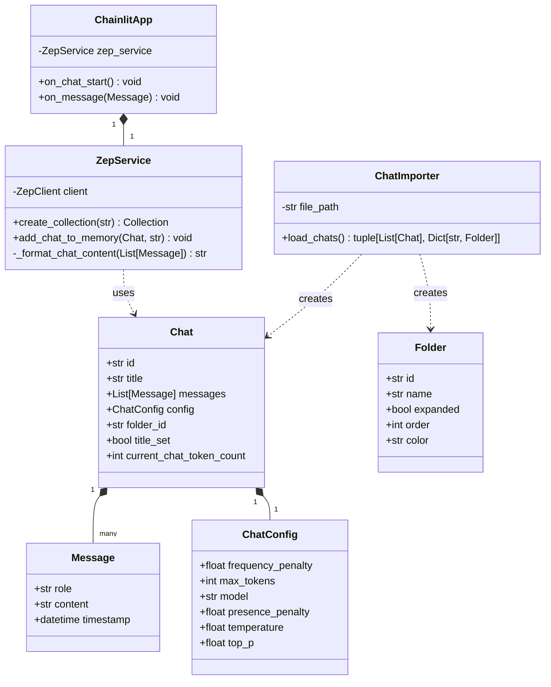

# RAG Application Specification Document

## 1. System Overview
This document specifies the design for a RAG (Retrieval Augmented Generation) application that imports chat history from MyChatAI exports into Zep memory and provides a Chainlit-based interface for querying this history.

## 2. Class Diagram



## 3. API Contracts

### 3.1 ChatImporter API

```python
class ChatImporter:
    """Imports chat history from JSON export files."""
    
    def __init__(self, file_path: str):
        """
        Initialize ChatImporter.
        
        Args:
            file_path (str): Path to the JSON export file
        """
        pass

    def load_chats(self) -> tuple[List[Chat], Dict[str, Folder]]:
        """
        Load chats and folders from the JSON file.
        
        Returns:
            tuple: (List of Chat objects, Dictionary of Folder objects)
            
        Raises:
            FileNotFoundError: If the JSON file doesn't exist
            JSONDecodeError: If the JSON file is invalid
        """
        pass
```

### 3.2 ZepService API

```python
class ZepService:
    """Manages interactions with Zep memory service."""
    
    def __init__(self, api_url: str, api_key: str):
        """
        Initialize ZepService.
        
        Args:
            api_url (str): Zep API URL
            api_key (str): Zep API key
        """
        pass

    async def create_collection(self, collection_name: str) -> Collection:
        """
        Create or get a Zep collection.
        
        Args:
            collection_name (str): Name of the collection
            
        Returns:
            Collection: Zep collection object
            
        Raises:
            ZepClientError: If collection creation fails
        """
        pass

    async def add_chat_to_memory(self, chat: Chat, collection_name: str) -> None:
        """
        Add a chat to Zep memory.
        
        Args:
            chat (Chat): Chat object to add
            collection_name (str): Target collection name
            
        Raises:
            ZepClientError: If adding to memory fails
        """
        pass

    def _format_chat_content(self, messages: List[Message]) -> str:
        """
        Format chat messages for storage.
        
        Args:
            messages (List[Message]): List of chat messages
            
        Returns:
            str: Formatted chat content
        """
        pass
```

### 3.3 Chainlit Event Handlers

```python
@cl.on_chat_start
async def start() -> None:
    """
    Initialize chat session.
    
    Sets up:
        - Chat history
        - Imports existing chats
        - Initializes Zep memory
    """
    pass

@cl.on_message
async def main(message: cl.Message) -> None:
    """
    Handle incoming chat messages.
    
    Args:
        message (cl.Message): Incoming message object
        
    Processing:
        1. Retrieves relevant context from Zep memory
        2. Generates response using context
        3. Updates chat history
    """
    pass
```

## 4. Data Models

### 4.1 Message Model
```python
@dataclass
class Message:
    role: str  # "user" | "assistant" | "system"
    content: str
    timestamp: Optional[datetime] = None
```

### 4.2 ChatConfig Model
```python
@dataclass
class ChatConfig:
    frequency_penalty: float
    max_tokens: int
    model: str
    presence_penalty: float
    temperature: float
    top_p: float
```

### 4.3 Chat Model
```python
@dataclass
class Chat:
    id: str
    title: str
    messages: List[Message]
    config: ChatConfig
    folder_id: str
    title_set: bool
    current_chat_token_count: int
```

### 4.4 Folder Model
```python
@dataclass
class Folder:
    id: str
    name: str
    expanded: bool
    order: int
    color: str
```

## 5. Configuration

### 5.1 Environment Variables
```env
ZEP_API_URL=<zep-api-url>
ZEP_API_KEY=<zep-api-key>
```

### 5.2 Collection Schema
```python
chat_document = {
    "chat_id": str,
    "title": str,
    "folder_id": str,
    "content": str  # Formatted chat content
}
```

## 6. Error Handling

### 6.1 Expected Exceptions
```python
class ChatImportError(Exception):
    """Raised when chat import fails"""
    pass

class ZepMemoryError(Exception):
    """Raised when Zep memory operations fail"""
    pass

class ConfigurationError(Exception):
    """Raised when configuration is invalid"""
    pass
```

## 7. Response Format

### 7.1 Search Response
```python
search_response = {
    "context": str,  # Retrieved context from Zep memory
    "response": str,  # Generated response
    "sources": List[str]  # Source chat IDs
}
```

## 8. Performance Considerations

1. **Batch Processing**
   - Import chats in batches of 100
   - Use async operations for Zep memory operations

2. **Caching**
   - Cache frequently accessed collections
   - Cache search results for similar queries

3. **Memory Management**
   - Limit context window size
   - Implement pagination for large result sets

## 9. Security Considerations

1. **Authentication**
   - Use environment variables for sensitive credentials
   - Implement API key rotation

2. **Data Privacy**
   - Sanitize personal information before storage
   - Implement data retention policies

## 10. Testing Strategy

```python
# Test Cases Structure
def test_chat_import():
    """Test chat import functionality"""
    pass

def test_zep_memory_operations():
    """Test Zep memory operations"""
    pass

def test_search_functionality():
    """Test search and retrieval"""
    pass

def test_error_handling():
    """Test error handling scenarios"""
    pass
```

Would you like me to elaborate on any specific aspect of this specification?
